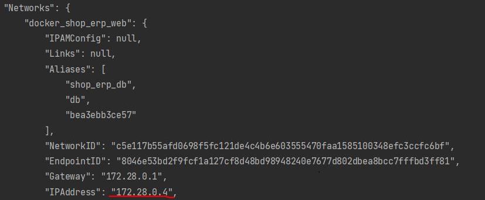

TODO improve docker set up
To set up project currently:
1.cd ./docker
2.docker compose up -d
3.docker exec shop_erp_app composer install
4.docker inspect shop_erp_db
5.Copy IpAddress value from docker_shop_erp_web to app/.env (replace ip at database connection)

